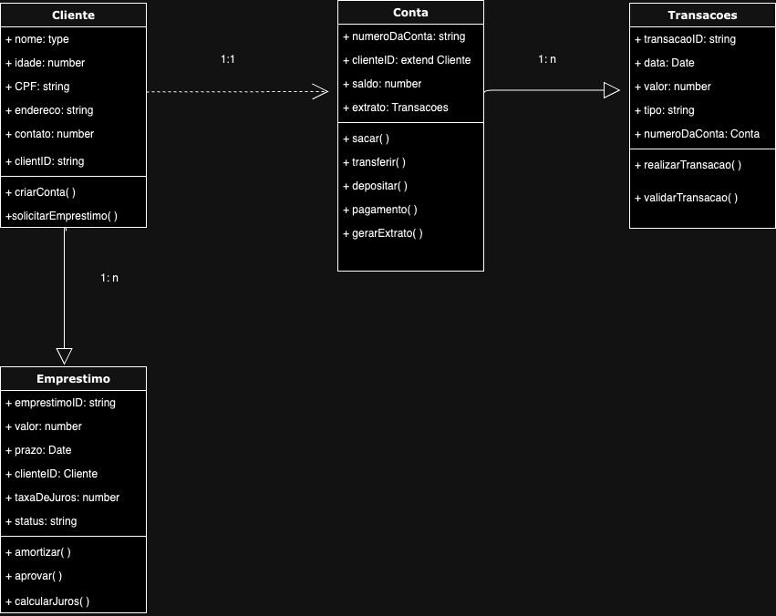

# ON36-IJS-Meu-Banco-Comunitario 🤎

Este projeto tem como objetivo criar um sistema de um banco comunitário ao longo das semanas do curso de imersão JS com foco em back-end e nuvem AWS da reprograma.

Diagrama de classes

